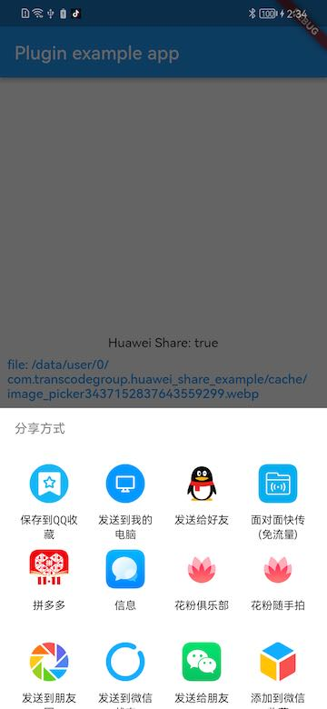
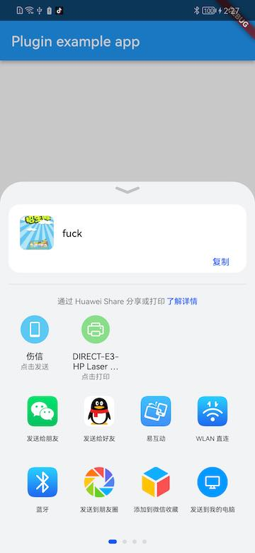

# huawei_share

Invoke the system sharing function of Huawei phones.

 ==> 

## Useage

see [example](example/lib/main.dart) for detail.

## Other

```shell
flutter create --template=plugin --platforms=android --org=com.transcodegroup huawei_share
```
